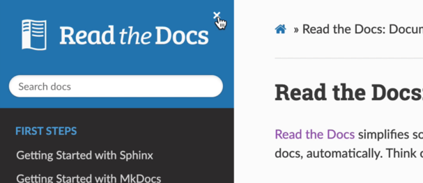

# Read The Docs More

Adds close sidebar button to readthedocs sites.

## Installation

1. Install [Tampermonkey]

1. Download script from [greasyfork]

[Tampermonkey]: https://chrome.google.com/webstore/detail/tampermonkey/dhdgffkkebhmkfjojejmpbldmpobfkfo/
[greasyfork]: https://greasyfork.org/en/scripts/429913-read-the-docs-more